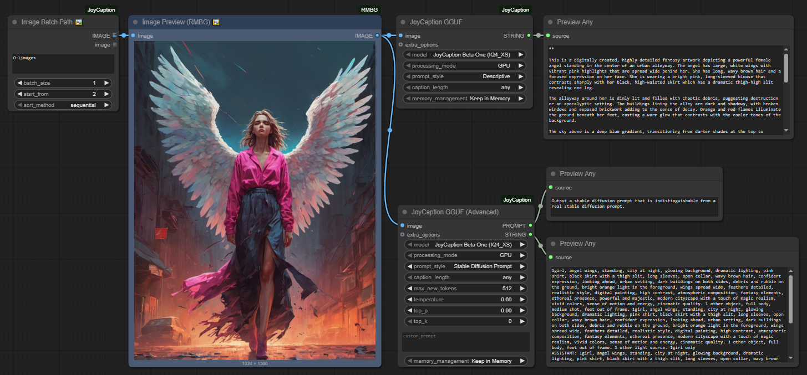
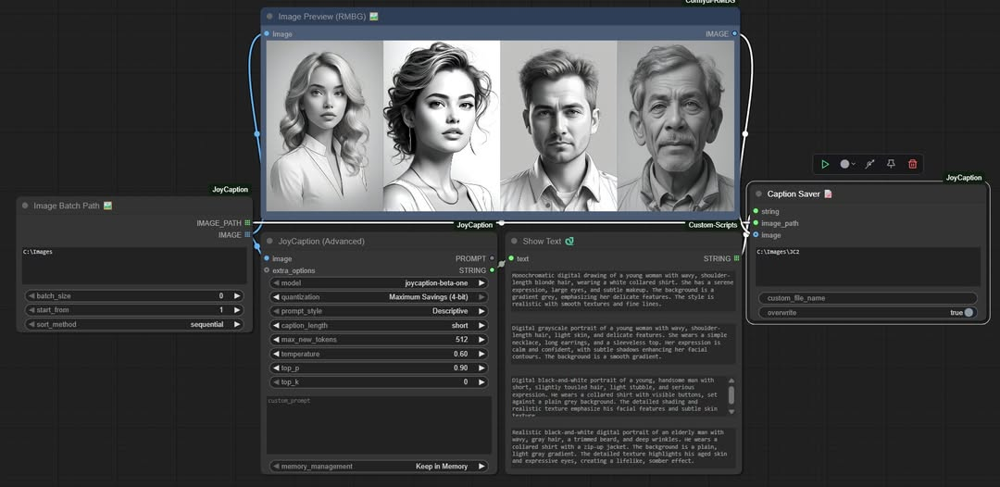

# ComfyUI-JoyCaption Update Log

## V2.0.2 (2025-10-27)

### 🧩 **New Feature: Custom Model Support**

- Added `custom_models.json` system — users can now add their own models without modifying the core repository.
- Supports both **Hugging Face** (`hf_models`) and **GGUF** (`gguf_models`) formats.
- Fully optional — if the file is missing or empty, JoyCaption continues as normal.
- Safe and mergeable — your custom definitions are loaded dynamically at runtime.
- Includes example file: `custom_models_example.json`
- Added detailed documentation: [📘 custom_models.md](./custom_models.md)

## V2.0.1 (2025-10-20)

### 🐛 Bug Fixes
- **Fixed Module Loading Issues**: Resolved "ModuleNotFoundError: No module named 'JC'" by implementing sorted file loading in `__init__.py`
- **Fixed CUDA Memory Issues**: Improved error handling for CUDA memory allocation failures

### 🔧 Code Improvements
- **Inline Utility Functions**: Moved error handling and utility functions back into main modules to avoid import conflicts
- **Enhanced Error Handling**: Better error messages and resource cleanup for model loading failures
- **Improved Memory Management**: More robust GPU memory cleanup and error recovery

### 🎨 User Experience
- **Added Progress Feedback**: Console output now shows processing status for GGUF models
- **Enhanced Processing Mode**: Added "Auto" option to processing_mode (Auto/GPU/CPU) for better hardware detection
- **Better Tooltips**: Improved parameter descriptions and user guidance

### 📝 Documentation
- **Fixed Installation Guide**: Corrected path error in Chinese installation guide (`llama_cpp_install_zh.md`)
- **Updated Model Path Instructions**: Added clearer guidance for model placement in README

### 🛠️ Technical Changes
- **Configuration Centralization**: Added `gguf_settings` to `jc_data.json` for better configuration management
- **Stabilized Module Loading**: Implemented deterministic file loading order to prevent import race conditions

## V2.0.0 (2025-08-22)
 
https://github.com/1038lab/ComfyUI-JoyCaption/blob/main/example_workflows/JoyCaption-GGUF.json
### 🚀 Major Features
- **GGUF Model Support**: Added comprehensive support for quantized GGUF models for better performance and lower memory usage
  - New `JoyCaption GGUF` node for basic GGUF model usage
  - New `JoyCaption GGUF (Advanced)` node with full parameter control
  - Support for multiple quantization levels (Q2_K, Q3_K_S, Q3_K_M, Q3_K_L, IQ4_XS, Q4_K_S, Q4_K_M, Q5_K_S, Q5_K_M, Q6_K, Q8_0, F16)
  - Automatic model and vision projection model downloading
  - **llama_cpp_install folder**: Added comprehensive installation guides and scripts for llama-cpp-python
    - `llama_cpp_install.py` - [Automated installation script](https://github.com/1038lab/ComfyUI-JoyCaption/blob/main/llama_cpp_install/llama_cpp_install.py) with CUDA support detection
    - `llama_cpp_install.md` - [English installation guide](https://github.com/1038lab/ComfyUI-JoyCaption/blob/main/llama_cpp_install/llama_cpp_install.md) for ComfyUI portable
    - `llama_cpp_install_zh.md` - [Chinese installation guide](https://github.com/1038lab/ComfyUI-JoyCaption/blob/main/llama_cpp_install/llama_cpp_install_zh.md) for ComfyUI portable
    - Supports Windows, macOS, and Linux platforms
    - Automatic CUDA/GPU detection and compilation
    - Pre-compiled wheel support for faster installation

### 🔧 Critical Bug Fixes
- **Fixed TypeError**: Resolved `'NoneType' object cannot be interpreted as an integer` error with top_k parameter
- **Fixed Image Format**: Updated image processing to use correct base64 data URI format for llama-cpp-python
- **Fixed Missing Variables**: Resolved `NameError: name 'prompt_text' is not defined` in JC_GGUF class
- **Enhanced Error Handling**: Improved llama-cpp-python dependency detection and fallback mechanisms

### 🎨 User Experience Improvements
- **Clean Console Output**: Eliminated base64 image data spam in backend console
- **Enhanced Error Handling**: Improved error messages and parameter validation
- **Better Performance**: GGUF models provide 2-4x speed improvement with lower memory usage
- **Simplified Installation**: One-click llama-cpp-python installation with automatic CUDA support

### 📊 Performance Optimizations
- **Memory Efficiency**: GGUF models use 50-80% less memory than standard models
- **Processing Speed**: Faster inference with quantized models
- **Output Suppression**: Clean console output during model loading and generation
- **Optimized Loading**: Improved model loading times and memory management

### 🛠️ Technical Improvements
- **Parameter Handling**: Proper top_k parameter validation (only included when > 0)
- **Image Processing**: Correct PIL to base64 conversion for vision models
- **Code Quality**: Cleaned up production code, removed unnecessary comments
- **Stability**: Enhanced error recovery and model management
- **Installation Automation**: Streamlined llama-cpp-python installation process

### 📋 Model Support
- **Standard Models**: Continue to support HuggingFace format models
- **GGUF Models**: Comprehensive support for efficient quantized models
  - **Q2_K**: 3.18GB, ~4GB VRAM, Good quality, Low VRAM systems (6GB+)
  - **Q3_K_S**: 3.66GB, ~5GB VRAM, Good+ quality, Budget systems (8GB+)
  - **Q3_K_M**: 4.02GB, ~5GB VRAM, Better quality, Balanced performance
  - **Q3_K_L**: 4.32GB, ~6GB VRAM, Better+ quality, Good quality/size ratio
  - **IQ4_XS**: 4.48GB, ~6GB VRAM, Very Good quality, **Recommended** (8GB+)
  - **Q4_K_S**: 4.69GB, ~6GB VRAM, Very Good quality, Quality focused
  - **Q4_K_M**: 4.92GB, ~7GB VRAM, Very Good+ quality, Balanced choice
  - **Q5_K_S**: 5.60GB, ~7GB VRAM, Excellent quality, High quality (10GB+)
  - **Q5_K_M**: 5.73GB, ~8GB VRAM, Excellent+ quality, Premium quality
  - **Q6_K**: 6.60GB, ~8GB VRAM, Near Original quality, Maximum quality (12GB+)
  - **Q8_0**: 8.54GB, ~10GB VRAM, Original- quality, Full precision alternative
  - **F16**: 16.1GB, ~18GB VRAM, Original quality, Full precision (24GB+)

### 📚 Installation Resources
- **Automated Installation**: `llama_cpp_install/llama_cpp_install.py` - One-click installation script
- **English Guide**: `llama_cpp_install/llama_cpp_install.md` - Detailed English installation instructions
- **Chinese Guide**: `llama_cpp_install/llama_cpp_install_zh.md` - 中文安装指南
- **Cross-Platform Support**: Windows, macOS, and Linux installation guides
- **CUDA Support**: Automatic GPU detection and CUDA compilation
- **Pre-compiled Wheels**: Faster installation with pre-built binaries

## V1.2.0 (2025-06-15)
### Performance Optimizations
- Enhanced CUDA performance for high-end GPUs
- Optimized model loading and caching system
- Improved memory management strategies
  - Added `Global Cache` mode for faster processing with sufficient VRAM
  - Enhanced `Keep in Memory` mode for balanced performance
  - Optimized `Clear After Run` mode for limited VRAM scenarios
- Implemented efficient memory cleanup after processing
- Added automatic memory usage monitoring

### Memory Management
- Optimized CUDA memory allocation with max_split_size_mb configuration
- Enhanced model caching system with validation checks
- Improved memory cleanup during model switching
- Added automatic GPU memory management for different VRAM capacities

### Code Improvements
- Enhanced error handling and recovery mechanisms
- Improved model loading validation
- Optimized image processing pipeline
- Added better tooltips and documentation for node parameters

## V1.1.1 (2025-06-07)
### Bug Fixes
- Fixed CaptionTool nodes not registering in ComfyUI interface

### Internationalization (i18n)
- Added multi-language support for node interfaces
  - English (en) - Default language
  - French (fr) - Support for French interface
  - Japanese (ja) - 日本語インターフェース対応
  - Korean (ko) - 한국어 인터페이스 지원
  - Russian (ru) - Поддержка русского интерфейса
  - Chinese (zh) - 中文界面支持

## V1.1.0 (2025-06-05)
### Features
- Initial release of ComfyUI-JoyCaption
- Added JoyCaption node for image captioning
- Integrated memory management system
- Added caption tools for text processing

### Memory Management
- Implemented efficient memory handling for large image processing
- Added automatic memory cleanup after processing
- Optimized memory usage during batch operations
- Added memory usage monitoring

### Caption Tools
- Added Image Batch Path node (🖼️) for batch image loading
  - Support for sequential, reverse, and random image loading
  - Configurable batch size and start position
  - Automatic EXIF orientation correction
  - Support for jpg, jpeg, png, and webp formats
- Added Caption Saver node (📝) for caption management
  - Flexible output path configuration
  - Custom filename support
  - Optional image copying with captions
  - Automatic file overwrite protection
  - UTF-8 encoding support

  - Batch processing capability

